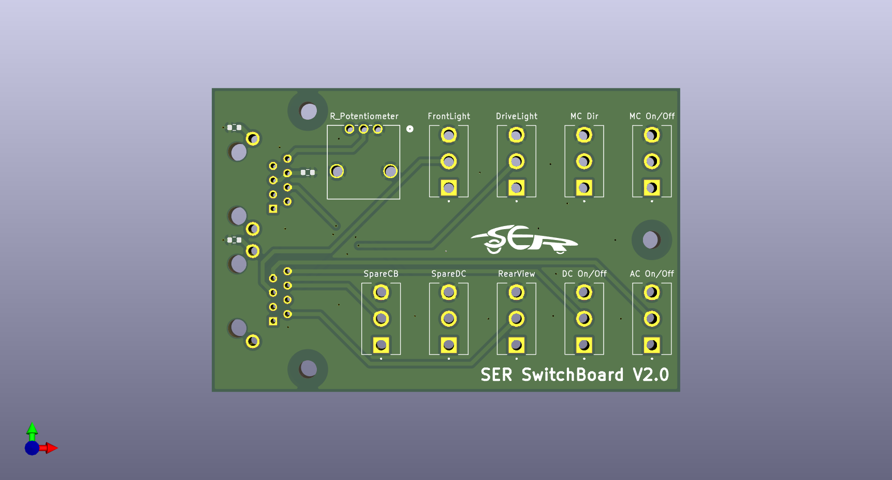
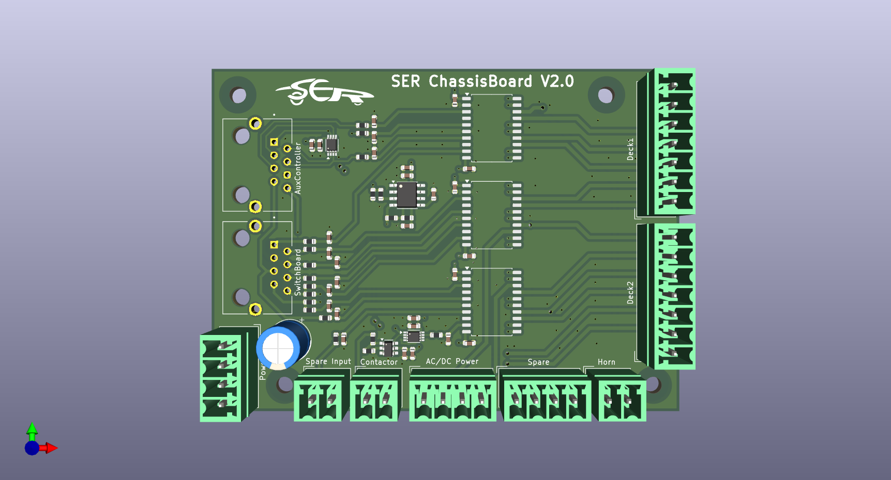
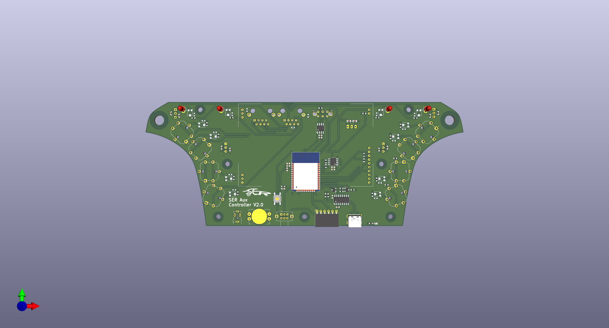
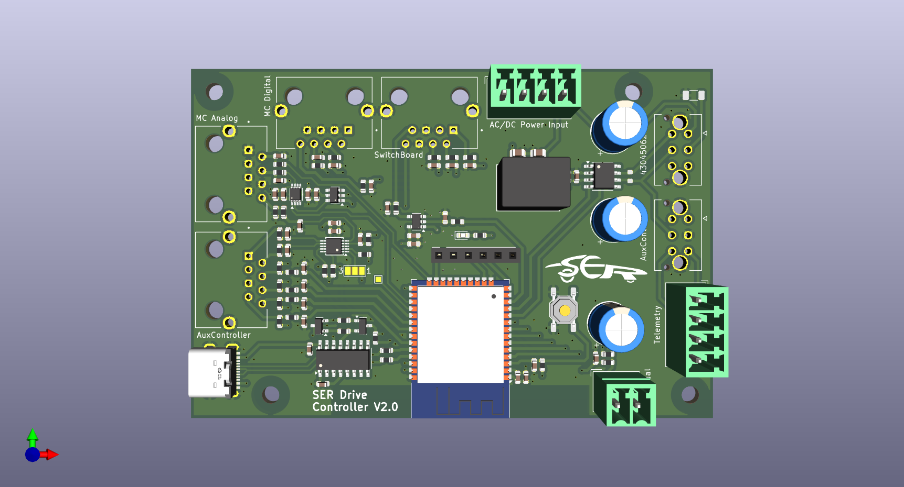

# solar_car_control_system_v6

[solarenergyracers.ch](https://www.solarenergyracers.ch) - control system (two controller based control system for SER6 solar car)


## Folder Structure

```Text
.
├── AC
│   ├── CMakeLists.txt
│   ├── dependencies.lock
│   ├── lib
│   │   ├── CarControl
│   │   ├── CarState
│   │   ├── CmdHandler
│   │   ├── ConfigReader
│   │   ├── Console
│   │   ├── definitions.h
│   │   ├── Display
│   │   ├── DisplayValue
│   │   ├── DriverDisplay
│   │   ├── EngineerDisplay
│   │   ├── GPIO
│   │   ├── interfaces
│   │   ├── LocalFunctionsAndDevices.h
│   │   ├── OneWireBus
│   │   ├── placeholder.txt
│   │   ├── SDCard
│   │   └── SPIBus
│   ├── platformio.ini
│   ├── sdkconfig
│   ├── sdkconfig.defaults
│   ├── sdkconfig.esp32dev
│   ├── sdkconfig.esp32dev-linux
│   ├── sdkconfig.esp32dev-windows
│   ├── ser_v6_AC.code-workspace
│   ├── src
│   │   ├── CMakeLists.txt
│   │   └── main.cpp
│   └── upload_no_build.py
├── archive_logs.py
├── data
├── datasheets
├── DC
│   ├── CMakeLists.txt
│   ├── dependencies.lock
│   ├── lib
│   │   ├── ADC
│   │   ├── CAN
│   │   ├── CarControl
│   │   ├── CarState
│   │   ├── CmdHandler
│   │   ├── ConstSpeed
│   │   ├── DAC
│   │   ├── definitions.h
│   │   ├── GPIO
│   │   ├── IOExt
│   │   ├── LocalFunctionsAndDevices.h
│   │   ├── OneWireBus
│   │   └── SPIBus
│   ├── platformio.ini
│   ├── sdkconfig
│   ├── sdkconfig.defaults
│   ├── sdkconfig.esp32dev
│   ├── sdkconfig.esp32dev-linux
│   ├── sdkconfig.esp32dev-windows
│   ├── ser_v6_DC.code-workspace
│   ├── src
│   │   ├── CMakeLists.txt
│   │   └── main.cpp
│   └── upload_no_build.py
├── docs
├── drafts
├── extras
├── fixes_for_librarys
│   ├── core.h
│   ├── fixes.md
│   └── rtc.h
├── lib_common
│   ├── CAN
│   ├── Console
│   ├── Helper
│   ├── I2CBus
│   ├── include
│   ├── interfaces
│   ├── RTC
│   ├── Serial
│   └── System
├── platformio.txt
├── README.md
├── reset_usb_numbering.py
└── start-vscode-for-AC-DC-workspace.py

```

## Drafts

- 
- 
- 
- 
- 

## Docs

- [Signal Flows](docs/SignalFlows.md)
- [CAN Signal](docs/SignalFlows_CAN-Definitions.md)
